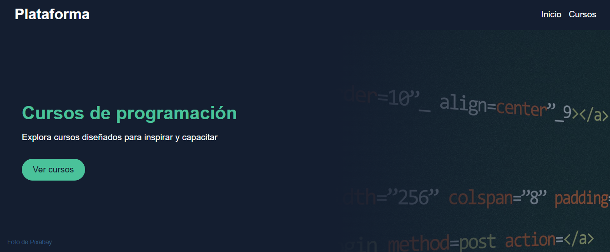

# Plataforma de Aprendizaje 🎓

Este es un proyecto de práctica desarrollado con React y React Router, donde se simula una plataforma de aprendizaje en línea. Incluye funcionalidades como:
✅ Listado de cursos con buscador dinámico
✅ Detalles de cada curso con estructura de módulos
✅ Sistema de navegación con rutas anidadas
✅ Diseño responsivo y accesible

[Link](https://plataforma1.netlify.app/)
